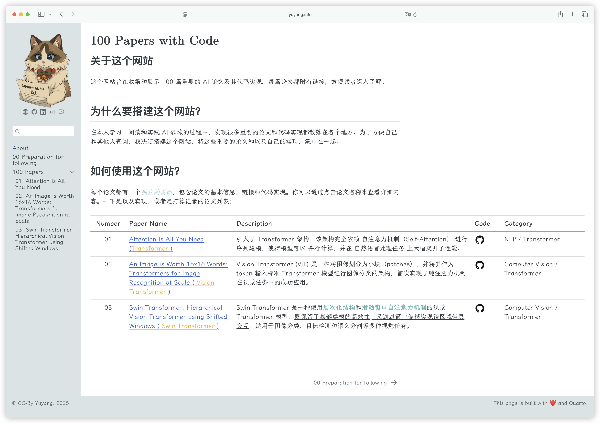

## About this repository

This repository contains the code for the website of [100 AI Papers with Code(PwC)](https://yuyang.info/100-AI-Papers/)

Below are list of the papers:
| Number | Paper Name | Description | Code | Blog | Recommendation |
| --- | -------------------------------------------------------------------------------- | -------------------------------------------------------------------------------- |--------------------------------------------------------------------------------- | ----------------------------------------------------------------- | --------------- |
| 01 | [Attention is All You Need ](https://arxiv.org/abs/1706.03762) (👾 **Transformer** 👾)| 引入了 Transformer 架构，该架构完全依赖 自注意力机制（Self-Attention） 进行序列建模，使得模型可以 并行计算，并在 自然语言处理任务 上大幅提升了性能。| [Code](https://github.com/YYZhang2025/100-AI-Code/blob/main/01_transformer.ipynb) | [Blog](https://yuyang.info/100-AI-Papers/posts/01-transformer.html) | ⭐️⭐️⭐️⭐️⭐️ |
| 02 | [An Image is Worth 16x16 Words: Transformers for Image Recognition at Scale](https://arxiv.org/abs/2010.11929) (👾 **Vision Transformer** 👾)| Vision Transformer (ViT) 是一种将图像划分为小块（patches），并将其作为 token 输入标准 Transformer 模型进行图像分类的架构，<u>首次实现了纯注意力机制在视觉任务中的成功应用</u>。| [Code](https://github.com/YYZhang2025/100-AI-Code/blob/main/02_vision_transformer.ipynb) | [Blog](https://yuyang.info/100-AI-Papers/posts/02-vision-transformer.html) | ⭐️⭐️⭐️⭐️⭐️ |
| 03 | [Swin Transformer: Hierarchical Vision Transformer using Shifted Windows](https://arxiv.org/abs/2103.14030) (👾 **Swin Transformer** 👾)| Swin Transformer 是一种使用**层次化结构**和**滑动窗口自注意力机制**的视觉 Transformer 模型，<u>既保留了局部建模的高效性，又通过窗口偏移实现跨区域信息交互</u>，适用于图像分类、目标检测和语义分割等多种视觉任务。 | [Code](https://github.com/YYZhang2025/100-AI-Code/blob/main/03_swin_transformer.ipynb) | [Blog](https://yuyang.info/100-AI-Papers/posts/03-swin-transformer.html) | ⭐️⭐️⭐️ |
| 04 | [Learning Transferable Visual Models From Natural Language Supervision](https://arxiv.org/abs/2103.00020) (👾 **CLIP** 👾)| CLIP 是一种利用大规模图文**对比学习**，将图像与自然语言映射到同一语义空间，从而实现零样本图像识别与跨模态检索的多模态基础模型 | [Code](https://github.com/YYZhang2025/100-AI-Code/blob/main/04_clip.ipynb) | [Blog](https://yuyang.info/100-AI-Papers/posts/04-clip.html) | ⭐️⭐️⭐️⭐️⭐️  |
| 05 | [FlashAttention: Fast and Memory-Efficient Exact Attention with IO-Awareness](https://arxiv.org/abs/2103.00020) (👾 **Flash Attention** 👾)| FlashAttention 是一种优化的注意力机制实现，通过减少内存访问和提升计算效率，实现更快、更节省资源的 Transformer 推理与训练。 | [Code](https://github.com/YYZhang2025/100-AI-Code/blob/main/05_flash_attention.ipynb) | [Blog](https://yuyang.info/100-AI-Papers/posts/05-flash-attention.html) | ⭐️⭐️⭐️  |
